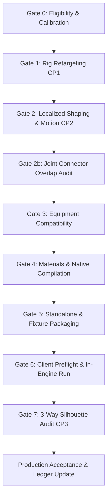

# Derived Phenotype Pipeline & Workflow Runbook

**Document Version:** 1.0  
**Date:** 2026-10-05  
**Scope:** Reusable pipeline for deriving race/gender/body-type phenotype variants from Human master bodies

---

## 1. Overview & Architectural Principles

The derived phenotype pipeline establishes a systematic, repeatable method for generating race and body-type variants across the Neverwinter Nights: Enhanced Edition character matrix using the accepted purpose-built Human master bodies as baseline donors.

### Core Principles
1. **Source Isolation:** Never modify `srn_body` master bytes. All derivations consume human master models read-only and stage outputs into target-isolated directories (`output/phenotypes/derived-<race>-<gender>-<version>`).
2. **Prerequisite Gates:** Derived targets strictly require an approved donor master body. Female derivations remain blocked until approval of the Human female master body.
3. **Rig & Connector Compatibility:** Stock equipment compatibility requires strict preservation of stock joint placement, orientation, and attachment coordinate frames. All 18 rigid connector attachment nodes must retain zero displacement during localized shaping.
4. **Controlled Mesh Deformation:** Localized shaping uses Wendland $C^2$ radial basis functions (RBF) with anatomical anchor pairs. Deformation is constrained to flesh regions, preserves positive Jacobian determinants ($J > 0$), and limits total mesh volume variance to within $\pm 0.5\%$.
5. **Shared Shading Assets:** Where UV topology is preserved from the donor, `.mtr` material files reference shared human normal and roughness maps (`pmh0_*n.tga`, `pmh0_*r.tga`), eliminating redundant high-resolution normal maps and saving ~340 MiB per race in distribution packages.
6. **Multi-Node Pelvis Architecture:** Pelvis models support multi-node trimesh geometry, maintaining separate flesh nodes (`*_pelvis001f`) with diffuse underwear textures and unskinned trimesh nodes (`*_pelvis001p`) with PLT skin palettes.
7. **Native Binary Verification:** All models are compiled with `nwmain.exe` and audited for normalized vertex normals, non-degenerate UVs, and valid finite MikkTSpace tangent spaces.
8. **Automated Client Inspection:** In-engine validation uses side-by-side comparison test modules against stock baseline control actors, executing scripted camera inspection sequences across standard poses and motions.

---

## 2. Pipeline Execution Gates

Deriving a phenotype proceeds through eight chronological, deterministic engineering gates. For complete mathematical definitions, measurement protocols, automated commands, receipts, and strict pass/fail thresholds, consult the authoritative standard: **[Phenotype Pipeline: Gate Measurement Process & Verification Standards](phenotype-gate-measurement-standards.md)**.



### Gate 0: Target Eligibility & Stature Calibration
- Inspect matrix eligibility via `tools/phenotypes/derived_matrix.py`.
- Query calibrated target stature from `tools/phenotypes/height_targets.json`.
- Verify donor master body availability and hashes.

### Gate 1: Rig Retargeting (Checkpoint CP1)
- Map donor skeleton to target race bone hierarchy via `tools/phenotypes/derive_rig.py`.
- Enforce max node deviation $\max \Delta p \le 0.000000\text{ m}$ across all 56 skeleton nodes.
- Retain stock attachment frames across all 18 rigid connector joints.
- Verify weapon and shield attachment dummy locators (`rhand`, `lhand`).
- Freeze rig receipt in `output/phenotypes/derived-v1/rigs/<target>/rig-receipt.json` and obtain user review.

### Gate 2: Localized Shaping & Motion Articulation (Checkpoint CP2)
- Configure target anatomical anchors in `tools/phenotypes/derived_profiles.py`.
- Execute Wendland $C^2$ RBF deformation via `tools/phenotypes/localized_refine.py`.
- Enforce strictly positive Jacobian determinants ($\min J > 0$) across all trimesh elements (zero triangle folding/inversion).
- Enforce strict volume preservation ($|\Delta V| \le \pm 1.0\%$) and zero displacement at all connector boundary rings ($< 10^{-12}\text{ m}$).
- Render unlit, clay, and worst-case motion articulation views via `tools/phenotypes/render_derived_dwarf_review.py` or race-specific renderer.

### Gate 2b: Joint Boundary Connector Overlap Audit
- Audit physical interface across all 13 adjacent body part pairs via `tools/phenotypes/audit_derived_connectors.py`.
- Verify positive axial insertion overlap ($\Delta z_{\text{axial}} \ge +0.7\text{ mm}$) to guarantee zero tearing during animation.
- Confirm `allConnectorsPassed == true` in `connector-audit.json`.

### Gate 3: Equipment Compatibility Audit
- Inventory available stock equipment models for target race via `tools/phenotypes/derived_equipment.py`.
- Audit 440 stock models across 18 armor slots for attachment frame alignment.
- Verify weapon locators match stock engine expectations ($0.000\text{ mm}$ tolerance).
- Record verified status in `equipment-receipt.json`.

### Gate 4: Materials & Native Binary Compilation
- Stage ASCII models, PLTs, diffuse TGAs, and MTR files via `tools/phenotypes/stage_derived_dwarf.py` (or race equivalent).
- Compile all 14 models with clean `nwmain.exe` via `tools/phenotypes/native_compile.py`.
- Audit compiled binary structures via `tools/phenotypes/audit_derived_dwarf_native.py`:
  - 100% valid unit tangents ($|T|=1.0$) and binormals (MikkTSpace).
  - Valid multi-node pelvis structure (flesh diffuse + skin PLT).
  - Zero compilation warnings or missing textures.

### Gate 5: Standalone & Fixture Packaging
- Build standalone distribution HAK (`srn_derived_<race>_test.hak`) via `nwn_erf.exe`.
- Extract stock game models and generate private dynamic alias (`pmz0`) via `tools/phenotypes/stock_dwarf_control.py`.
- Stage test module resources and build comparison test module (`srn_pheno_test.mod`) and HAK (`srn_pheno_test.hak`) via `tools/phenotypes/build_test_module.py`.

### Gate 6: Client Preflight & In-Engine Run
- Execute preflight audit via `tools/phenotypes/preflight_derived_dwarf_client.py`:
  - Confirm HAK and module SHA256 match build receipts.
  - Confirm `override` directory contains **0 files** (100% HAK isolation).
  - Verify all candidate and stock comparator models are packed.
  - Confirm client binary hash matches compiler binary hash.
- Request user confirmation prior to launching `nwmain.exe`.
- Execute interactive test runner `tools/phenotypes/run_derived_dwarf_client_test.py`:
  - Run 135-second automated inspection sequence for bare torso and joint alignment.
  - Execute separate equipment-focused camera run (`--equipment-target`) to inspect equipped armor fit and log markers.
  - Sample process memory and CPU performance metrics.
  - Extract and verify timestamped `PHENOTYPE_` engine log entries and require clean client and engine logs.

### Gate 7: 3-Way Silhouette & Morphological Overlap Audit (Checkpoint CP3)
- Execute automated 3-way silhouette comparison via `tools/phenotypes/build_silhouette_comparison_sheet.py`.
- Compute exact quantitative overlap metrics via `tools/phenotypes/calculate_silhouette_difference.py`. Follow [the silhouette workflow runbook](phenotype-silhouette-workflow.md).
- Enforce pass thresholds:
  - Upper Torso DICE $\ge 80.0\%$.
  - Pelvis & Waist DICE $\ge 75.0\%$.
  - Stance Width Ratio within $80.0\% - 95.0\%$.
  - Baseline Gain over stock master $> 0.0\%$.
- Compile final pilot validation report (`docs/phenotype-derived-<race>-pilot.md`).
- Record completed entry in `output/phenotypes/derived-v1/ledger.json`.

---

## 3. Command Reference

### Checking Target Eligibility
```powershell
python tools/phenotypes/derived_matrix.py
```

### Deriving Rig & Anchor Hierarchy
```powershell
# Standard shared tool launch:
python tools/phenotypes/launch_shared_tool.py `
  --toolchain .tmp/runtime-bindings/run-001.json `
  --migration-receipt .tmp/shared-tool-migration.json `
  --tool python --output ".tmp/derived-launches/$([guid]::NewGuid().ToString('N'))" `
  --input tools/phenotypes/configurations/derived/target-dwarf-male-stock.json `
  --input output/phenotypes/derived-v1/masters/human-male-v1/stock/pmd0.mdl `
  -- tools/phenotypes/derive_rig.py tools/phenotypes/configurations/derived/target-dwarf-male-stock.json

# Direct CLI invocation:
python tools/phenotypes/derive_rig.py tools/phenotypes/configurations/derived/target-dwarf-male-stock.json
```

### Localized Deformation
```powershell
# Using launch_shared_tool wrapper with declared inputs:
python tools/phenotypes/launch_shared_tool.py `
  --toolchain .tmp/runtime-bindings/run-001.json `
  --migration-receipt .tmp/shared-tool-migration.json `
  --tool python --output ".tmp/derived-launches/$([guid]::NewGuid().ToString('N'))" `
  --input tools/phenotypes/configurations/derived/target-dwarf-male-stock.json `
  -- tools/phenotypes/localized_refine.py --target tools/phenotypes/configurations/derived/target-dwarf-male-stock.json

# Direct CLI invocation:
python tools/phenotypes/localized_refine.py --target tools/phenotypes/configurations/derived/target-dwarf-male-stock.json
```

### Motion & Visual Rendering
```powershell
python tools/phenotypes/render_derived_dwarf_review.py
```

### Equipment Audit
```powershell
# Using launch_shared_tool wrapper with declared inputs:
python tools/phenotypes/launch_shared_tool.py `
  --toolchain .tmp/runtime-bindings/run-001.json `
  --migration-receipt .tmp/shared-tool-migration.json `
  --tool python --output ".tmp/derived-launches/$([guid]::NewGuid().ToString('N'))" `
  --input tools/phenotypes/configurations/derived/target-dwarf-male-stock.json `
  -- tools/phenotypes/derived_equipment.py --config tools/phenotypes/configurations/derived/target-dwarf-male-stock.json

# Direct CLI invocation:
python tools/phenotypes/derived_equipment.py --config tools/phenotypes/configurations/derived/target-dwarf-male-stock.json
```

### Staging & Native Compilation
```powershell
python tools/phenotypes/stage_derived_dwarf.py
python tools/phenotypes/native_compile.py --converted output/phenotypes/derived-dwarf-male-v1/candidate/converted --user-directory output/phenotypes/derived-dwarf-male-v1/compiler-userdir --client "C:\Program Files (x86)\GOG Galaxy\Games\Neverwinter Nights Enhanced Edition\bin\win32\nwmain.exe" --with-material-resources
python tools/phenotypes/audit_derived_dwarf_native.py
```

### Comparison Fixture Construction
```powershell
# Use the Python path from the current byte-bound runtime binding.
$binding = Get-Content .tmp/runtime-bindings/run-001.json -Raw | ConvertFrom-Json
$python = if ($binding.runtimes) { $binding.runtimes.python.path } else { $binding.tools.python.path }
$gameRoot = "C:\Program Files (x86)\GOG Galaxy\Games\Neverwinter Nights Enhanced Edition"
$stage = "output/phenotypes/derived-dwarf-male-v1/test-stage"
# Freeze maintained helpers, their portable configs and durable reference assets.
# Overdeclare tracked tool inputs so transitive helper imports are also covered.
$helperInputs = @()
git ls-files -- tools | ForEach-Object { $helperInputs += @('--input', $_) }
# Resource extraction and fallback can read the installed game archives and loose
# resources. Freeze this read-only installation, including directory membership.
# This hashes the installation once before and once after each launch.
$gameInputs = @('--input-tree', $gameRoot)
# Keep launch receipts separate from the reusable fixture stage. Each wrapper
# below allocates a fresh UUID receipt directory, even when rerunning a step.
# 1. Initialize fixture stage, baseline resources, and candidate staging:
& $python tools/phenotypes/launch_shared_tool.py @helperInputs @gameInputs `
  --toolchain .tmp/runtime-bindings/run-001.json `
  --migration-receipt .tmp/shared-tool-migration.json `
  --tool python --output ".tmp/derived-launches/$([guid]::NewGuid().ToString('N'))" `
  --input-tree output/phenotypes/derived-dwarf-male-v1/candidate/converted `
  -- tools/phenotypes/build_derived_dwarf_fixture.py --stage output/phenotypes/derived-dwarf-male-v1/test-stage

# 2. Stage stock comparator actor:
& $python tools/phenotypes/stock_dwarf_control.py --game-root "C:\Program Files (x86)\GOG Galaxy\Games\Neverwinter Nights Enhanced Edition" --client "C:\Program Files (x86)\GOG Galaxy\Games\Neverwinter Nights Enhanced Edition\bin\win32\nwmain.exe"

# 3. Build test module with launch_shared_tool (bare torso inspection sequence):
& $python tools/phenotypes/launch_shared_tool.py @helperInputs @gameInputs `
  --toolchain .tmp/runtime-bindings/run-001.json `
  --migration-receipt .tmp/shared-tool-migration.json `
  --tool python --output ".tmp/derived-launches/$([guid]::NewGuid().ToString('N'))" `
  --input output/phenotypes/derived-dwarf-male-v1/test-stage/manifest.json `
  --input-tree output/phenotypes/derived-dwarf-male-v1/test-stage/baseline `
  --input-tree output/phenotypes/derived-dwarf-male-v1/test-stage/fixture-resources `
  --input-tree output/phenotypes/derived-dwarf-male-v1/test-stage/dwarf_male_fit/converted `
  --input-tree output/phenotypes/derived-dwarf-male-v1/test-stage/stock_dwarf_male_fit/converted `
  -- tools/phenotypes/build_test_module.py --slugs dwarf_male_fit,stock_dwarf_male_fit --full-equipment-template output/phenotypes/derived-dwarf-male-v1/test-stage/baseline/full-armor-template.json --stock-equipment-fallback --torso-inspection-sequence --camera-target dwarf_male_fit --game-root "C:\Program Files (x86)\GOG Galaxy\Games\Neverwinter Nights Enhanced Edition" --output output/phenotypes/derived-dwarf-male-v1/test-stage

# 4. Preflight and run the bare torso module BEFORE the equipment rebuild:
& $python tools/phenotypes/preflight_derived_dwarf_client.py
& $python tools/phenotypes/run_derived_dwarf_client_test.py
if ($LASTEXITCODE) { throw "Bare torso inspection failed; retain this module for diagnosis." }

# 5. Build separate equipment-focused test module (focuses camera on full-armor actor):
& $python tools/phenotypes/launch_shared_tool.py @helperInputs @gameInputs `
  --toolchain .tmp/runtime-bindings/run-001.json `
  --migration-receipt .tmp/shared-tool-migration.json `
  --tool python --output ".tmp/derived-launches/$([guid]::NewGuid().ToString('N'))" `
  --input output/phenotypes/derived-dwarf-male-v1/test-stage/manifest.json `
  --input-tree output/phenotypes/derived-dwarf-male-v1/test-stage/baseline `
  --input-tree output/phenotypes/derived-dwarf-male-v1/test-stage/fixture-resources `
  --input-tree output/phenotypes/derived-dwarf-male-v1/test-stage/dwarf_male_fit/converted `
  --input-tree output/phenotypes/derived-dwarf-male-v1/test-stage/stock_dwarf_male_fit/converted `
  -- tools/phenotypes/build_test_module.py --slugs dwarf_male_fit,stock_dwarf_male_fit --full-equipment-template output/phenotypes/derived-dwarf-male-v1/test-stage/baseline/full-armor-template.json --stock-equipment-fallback --camera-target dwarf_male_fit --camera-equipment-target --camera-pitch 75.0 --camera-distance 4.0 --camera-height 1.2 --game-root "C:\Program Files (x86)\GOG Galaxy\Games\Neverwinter Nights Enhanced Edition" --output output/phenotypes/derived-dwarf-male-v1/test-stage

# 6. Preflight and run the equipment-focused module after its rebuild:
& $python tools/phenotypes/preflight_derived_dwarf_client.py
& $python tools/phenotypes/run_derived_dwarf_client_test.py --equipment-target
if ($LASTEXITCODE) { throw "Equipment inspection failed; retain this module for diagnosis." }
```

Each client run preserves its preflight, fixture receipt, full client and engine logs,
launch record, filtered log and metrics under a fresh `review/client-run-<uuid>`
directory. These paths remain verifiable after the fixture is rebuilt.

Both builds publish the same live `srn_pheno_test.mod`, HAK and fixture receipt.
Complete step 4 and preserve its build receipt, logs and seven-phase torso evidence
before step 5 replaces that module. Complete step 6 against the equipment build
and preserve its separate evidence. The runner infers equipment mode from the
current fixture receipt; omitting `--equipment-target` after the equipment rebuild
does not restore the torso sequence. Apply this build/run/build/run order to each
race, using that target's stage paths and `--race`/`--prefix` client arguments.

---

## 4. Troubleshooting & Traps

| Symptom | Root Cause | Resolution |
| :--- | :--- | :--- |
| `Missing native compilation receipt` | Staging userdir matches client-test userdir | Staging and compiler must use separate directories (e.g. `compiler-userdir`). |
| `Access is denied` during preflight | Subprocess execution of binaries outside workspace | Use direct archive parser (`preflight_derived_dwarf_client.py`) instead of shelling out to `nwn_erf.exe`. |
| Stock comparator models display standard human skin | Stock dwarf models internally reference `pmh0` palettes | Ensure alias generation (`stock_dwarf_control.py`) inspects decompiled ASCII bitmaps to rewrite references properly. |
| In-engine client closes prematurely | Parent process terminated or job object closed | Use `run_derived_dwarf_client_test.py` to maintain the process handle and monitor until `PHENOTYPE_TORSO_SEQUENCE_COMPLETE`. |
