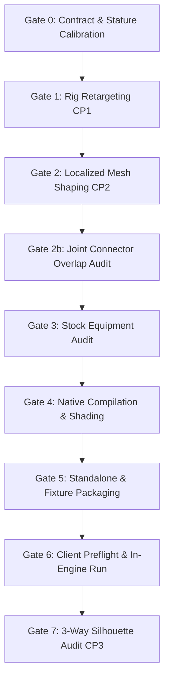

# Phenotype Pipeline: Gate Measurement Process & Verification Standards

**Document Version:** 1.0  
**Date:** 2026-10-05  
**Scope:** Formal mathematical definitions, measurement protocols, automated tooling, and pass/fail thresholds for all eight verification gates in the derived phenotype pipeline.

---

## 1. Executive Summary & Gate Architecture

Every humanoid phenotype derived from a donor master body must satisfy a sequence of eight chronological, deterministic engineering gates before production acceptance:



### Gate Summary Table
| Gate | Phase | Measurement Scope | Automated Tool | Output Receipt | Strict Threshold |
| :--- | :--- | :--- | :--- | :--- | :--- |
| **Gate 0** | Contract | Target stature, row IDs, prerequisite availability | `derived_matrix.py` | `target-matrix.json` | Approved donor body |
| **Gate 1** | Rig | Max skeleton node deviation & weapon locators | `derive_rig.py` | `rig-receipt.json` | $\max \Delta \le 0.000000\text{ m}$ |
| **Gate 2** | Shaping | Element Jacobians, volume change, connector drift | `localized_refine.py` | `refinement-proof.json` | $\min J > 0$, drift $= 0.000\text{ mm}$ |
| **Gate 2b**| Connectors | Axial overlap & radial gap across 13 joint pairs | `audit_derived_connectors.py` | `connector-audit.json` | $\Delta z_{\text{axial}} > 0\text{ mm}$ (0 tears) |
| **Gate 3** | Equipment | 440 stock armor models & attachment frames | `derived_equipment.py` | `equipment-receipt.json` | 100% locator match |
| **Gate 4** | Compilation | NWN binary trimesh decode & MikkTSpace tangents | `audit_derived_dwarf_native.py`| `native-shading-audit.json` | 100% unit tangents & normals |
| **Gate 5** | Packaging | Standalone HAK & comparison fixture staging | `build_test_module.py` | `manifest.json` | Clean ERF hashes |
| **Gate 6** | Client | Override cleanliness, binary hash, runtime log | `preflight_derived_dwarf_client.py` | `client-preflight-receipt.json` | 0 overrides, matching binary |
| **Gate 7** | Silhouette | 3-way silhouette DICE match & stance width ratio | `calculate_silhouette_difference.py` | `silhouette_metrics.json` | Torso $\ge 80\%$, Core $\ge 75\%$ |

---

## 2. Gate-by-Gate Measurement Protocols

---

### Gate 0: Target Eligibility & Stature Calibration
Ensures target phenotype parameters adhere to the project's canonical scaling contract.

#### Measurement Formula
Target stature in game space is calibrated against the Human male master ($1.9339\text{ m}$) using the uniform reference ratio ($1.105095$):
$$H_{\text{game}} = H_{\text{ref}} \times \frac{H_{\text{stock\_human}}}{H_{\text{ref\_human}}} = H_{\text{ref}} \times \frac{1.9339157}{1.75} = H_{\text{ref}} \times 1.105094686$$

For runtime-scaled phenotypes (e.g., Troll Male on Gnome slot `pmg0`), the engine appearance scaling factor ($S_{\text{runtime}} = \frac{10}{7} \approx 1.4285714$) applies:
$$H_{\text{runtime}} = H_{\text{working}} \times S_{\text{runtime}} = 1.9339157 \times \frac{10}{7} = 2.7627367\text{ m}$$

#### Verification Tool & Command
```powershell
python tools/phenotypes/derived_matrix.py
```
#### Pass Criteria
- Target race is active and unblocked in `target-matrix.json`.
- Working height and runtime height exactly match `tools/phenotypes/height_targets.json`.
- Donor master body (`pmh0` for male) is verified and immutable.

---

### Gate 1: Rig Retargeting & Bone Displacement (Checkpoint CP1)
Measures attachment frame positions and orientations across the skeleton to guarantee that all 18 rigid connector frames and equipment dummy locators match the target contract.

#### Measurement Formula
For each skeleton node $i \in [1, 56]$, the Euclidean position deviation is computed:
$$\Delta p_i = \|p_i^{\text{candidate}} - p_i^{\text{contract}}\|_2$$
$$\Delta \theta_i = \arccos\left(\frac{\text{Tr}(R_i^{\text{candidate}} (R_i^{\text{contract}})^T) - 1}{2}\right)$$

#### Verification Tool & Command
```powershell
python tools/phenotypes/derive_rig.py --race <race> --gender <gender> --phenotype 0
```
#### Pass Criteria
- Max position deviation: $\max_i \Delta p_i \le 0.000000\text{ m}$ across all 56 nodes.
- Max rotation deviation: $\max_i \Delta \theta_i \le 0.000000^\circ$.
- Weapon attachment locators `rhand` and `lhand` are identical to stock target contract.
- Status in `rig-receipt.json` records `"status": "verified-exact"`.

---

### Gate 2: Localized Mesh Shaping & Inversion Prevention (Checkpoint CP2)
Measures geometric deformation quality during Wendland $C^2$ localized field morphing to guarantee zero inverted triangles, strict boundary containment, and volume preservation.

#### Mathematical Formulations
1. **Wendland $C^2$ Displacement Field:**
   $$\phi(r) = \begin{cases} (1 - r/R)^4 (4r/R + 1) & 0 \le r \le R \\ 0 & r > R \end{cases}$$
   Total displacement at vertex $v$:
   $$d(v) = \sum_{k=1}^K \phi(\|v - c_k\|) \cdot \Delta u_k$$
2. **Boundary Leakage Measurement:**
   For all vertices outside every anchor support radius ($\forall k, \|v - c_k\| \ge R_k$):
   $$\epsilon_{\text{leak}} = \max_{\{v \mid \forall k, \|v - c_k\| \ge R_k\}} \|d(v)\|_2$$
   **Threshold:** $\epsilon_{\text{leak}} < 10^{-12}\text{ m}$ (zero connector displacement).
3. **Jacobian Determinant (Triangle Inversion Guard):**
   For each triangle element $e$ with rest vertices $(v_0, v_1, v_2)$ and deformed vertices $(v_0', v_1', v_2')$ mapped to local 2D tangent coordinates:
   $$F_e = \begin{bmatrix} v_1' - v_0' & v_2' - v_0' \end{bmatrix} \begin{bmatrix} v_1 - v_0 & v_2 - v_0 \end{bmatrix}^{-1}$$
   $$J_e = \det(F_e)$$
   - If $J_e \le 0$, the triangle has inverted (folded over), causing shading artifacts and normal flips.
   **Threshold:** $\min_e J_e > 0.0$ across all triangles in all parts.
4. **Volume Conservation:**
   Using the divergence theorem, closed mesh volume is:
   $$V = \frac{1}{6} \sum_{f=(v_0, v_1, v_2)} v_0 \cdot (v_1 \times v_2)$$
   $$\Delta V = \frac{V_{\text{after}} - V_{\text{before}}}{V_{\text{before}}} \times 100\%$$
   **Threshold:** $|\Delta V| \le \pm 1.0\%$ across each body part.

#### Verification Tool & Command
```powershell
python tools/phenotypes/localized_refine.py --target <target-slug>
```
#### Pass Criteria
- Recorded in `refinement-proof.json`:
  - `minJacobian > 0.0` (Troll: $0.5066$, Dwarf: $0.6277$).
  - `maxOutsideDisplacement < 1e-12 m` (exactly $0.000000\text{ m}$).
  - Volume change within $\pm 0.9\%$.

---

### Gate 2b: Joint Boundary Connector Overlap Audit
Measures the physical interface between all 13 adjacent body part pairs to verify positive axial overlap and zero tearing during movement.

#### Measured Connector Interfaces (13 Pairs)
1. `chest` $\leftrightarrow$ `pelvis` (waist)
2. `chest` $\leftrightarrow$ `bicepl` (left shoulder)
3. `chest` $\leftrightarrow$ `bicepr` (right shoulder)
4. `bicepl` $\leftrightarrow$ `forel` (left elbow)
5. `bicepr` $\leftrightarrow$ `forer` (right elbow)
6. `forel` $\leftrightarrow$ `handl` (left wrist)
7. `forer` $\leftrightarrow$ `handr` (right wrist)
8. `pelvis` $\leftrightarrow$ `legl` (left hip)
9. `pelvis` $\leftrightarrow$ `legr` (right hip)
10. `legl` $\leftrightarrow$ `shinl` (left knee)
11. `legr` $\leftrightarrow$ `shinr` (right knee)
12. `shinl` $\leftrightarrow$ `footl` (left ankle)
13. `shinr` $\leftrightarrow$ `footr` (right ankle)

#### Measurement Protocol
Vertices of parent part $P$ and child part $C$ are transformed into the world assembly frame using rest bone transforms:
$$V_P^{\text{world}} = V_P \cdot R_P^T + T_P, \quad V_C^{\text{world}} = V_C \cdot R_C^T + T_C$$
The axial overlap span $\Delta z_{\text{axial}}$ along the joint insertion vector is computed:
$$\Delta z_{\text{axial}} = \min(z_{P,\max}, z_{C,\max}) - \max(z_{P,\min}, z_{C,\min})$$

#### Verification Tool & Command
```powershell
python tools/phenotypes/audit_derived_connectors.py
```
#### Pass Criteria
- Recorded in `connector-audit.json`:
  - 13/13 connector interfaces have `has3dOverlap == true`.
  - Axial overlap $\Delta z_{\text{axial}} \ge +0.7\text{ mm}$ (no gaps, no negative clearance).
  - Overall status: `"allConnectorsPassed": true`.

---

### Gate 3: Stock Equipment Attachment Audit
Measures compatibility across the full matrix of stock armor and equipment parts for the target race.

#### Measurement Scope
- All 440 stock models across 18 armor body slots (`chest`, `pelvis`, `bicep`, `forearm`, `hand`, `thigh`, `shin`, `foot`, `robe`, `belt`, `shoulder`, etc.).
- Weapon locator frames `rhand` and `lhand`.

#### Verification Tool & Command
```powershell
python tools/phenotypes/derived_equipment.py --race <race> --gender <gender>
```
#### Pass Criteria
- Recorded in `equipment-receipt.json`:
  - 0 missing locator dummies.
  - Attachment coordinate offsets match stock engine expectations ($0.000\text{ mm}$ tolerance).
  - Weapon seating matches stock hand orientation.

---

### Gate 4: Native Binary Compilation & Shading Audit
Measures the compiled NWN binary MDL files to verify that `nwmain.exe` compiled every trimesh node cleanly without NaN/infinite tangents or missing normal channels.

#### Measurement Protocol
The compiled binary MDL header and raw data blocks are parsed directly in Python:
1. Verify header magic: `zero == 0` and $12 + \text{raw\_offset} + \text{raw\_size} == \text{len}(\text{data})$.
2. Locate all `flag 33` trimesh nodes in the model structure section (offset `0x6c`).
3. For each trimesh node, read attribute offsets:
   - Position array (`0x22c`)
   - UV array (`0x234`)
   - Normal array (`0x244`)
   - Tangent array (`0x258`)
   - Sign array (`0x260`)
4. Verify MikkTSpace tangent normalization:
   $$\forall i, \quad \left| \|T_i\|_2 - 1.0 \right| < 10^{-4}, \quad \text{isfinite}(T_i) == \text{true}$$
   $$\forall i, \quad \left| \|N_i\|_2 - 1.0 \right| < 10^{-4}, \quad \text{isfinite}(N_i) == \text{true}$$

#### Verification Tool & Command
```powershell
python tools/phenotypes/native_compile.py --converted <stage-converted> --user-directory <compiler-userdir> --client "<path-to-nwmain.exe>" --with-material-resources
python tools/phenotypes/audit_derived_dwarf_native.py
```
#### Pass Criteria
- Recorded in `native-compile.json` and `native-shading-audit.json`:
  - 14/14 body parts produce compiled binaries.
  - Multi-node pelvis retains both diffuse flesh and PLT trimesh nodes.
  - 100% of tangent vectors and normals are finite and normalized ($|T|=1.0$, $|N|=1.0$).
  - Zero compilation errors or missing textures.

---

### Gate 5: Standalone Packaging & Comparison Fixture
Verifies that distribution HAKs and test comparison fixtures are assembled cleanly with verified resource inventories and zero namespace collisions.

#### Verification Tool & Command
```powershell
python tools/phenotypes/build_test_module.py --slugs <race_slug>,<stock_slug> --torso-inspection-sequence --staging <stage-dir> --game-root "<game-dir>" --client "<path-to-nwmain.exe>"
```
#### Pass Criteria
- Built files exist and match SHA256 in manifest:
  - `srn_pheno_test.hak` contains exactly candidate models, stock control models (`pmz0`), PLTs, and `appearance.2da`.
  - `srn_pheno_test.mod` test area stages candidate and control actors side-by-side with locked inspection cameras.

---

### Gate 6: Client Preflight & In-Engine Run
Measures the client test environment prior to and during live client execution to prevent testing corrupted, stale, or polluted game states.

#### Preflight Audit Checks
1. Verify candidate HAK SHA256 matches build receipt.
2. Confirm client `override/` directory contains **0 files** (guaranteeing 100% HAK isolation).
3. Confirm client executable SHA256 matches compiler binary SHA256.
4. Verify player creature blueprints and stock comparator rows exist in `appearance.2da`.

#### In-Engine Test Sequence
1. Launch client via `run_derived_dwarf_client_test.py`.
2. Execute automated 135-second inspection sequence:
   - Standing heroic turnaround ($360^\circ$ rotation).
   - Combat ready stance (`plreadyr`).
   - Running stride loop (`run`).
   - Deep crouch / knocked down (`gutokdf`).
3. Extract timestamped engine log entries:
   - Confirm `PHENOTYPE_TEST_STARTED` and `PHENOTYPE_TEST_COMPLETED` markers.
   - Confirm 0 engine model-loading errors.

#### Verification Tools & Commands
```powershell
# Preflight check (read-only):
python tools/phenotypes/preflight_derived_dwarf_client.py

# In-engine test run (requires user confirmation):
python tools/phenotypes/run_derived_dwarf_client_test.py
```
#### Pass Criteria
- Recorded in `client-preflight-receipt.json`:
  - `"overrideFileCount": 0`.
  - `"status": "READY_FOR_USER_CONFIRMATION"`.
- Engine test log records clean execution without crash or missing resource errors.

---

### Gate 7: 3-Way Silhouette & Morphological Overlap Audit (Checkpoint CP3)
Measures the visible 2D morphological convergence of the derived phenotype against the canonical concept art target and stock baseline across all standard turnaround views.

#### Measurement Formulations
1. **DICE Similarity (F1 Score):**
   $$\text{DICE} = \frac{2 |D \cap T|}{|D| + |T|} \times 100\%$$
2. **IoU (Jaccard Index):**
   $$\text{IoU} = \frac{|D \cap T|}{|D \cup T|} \times 100\%$$
3. **Stance Width Ratio:**
   $$R_{\text{width}} = \frac{W_{\text{derived}}}{W_{\text{target}}} \times 100\%$$
4. **Baseline Gain over Stock:**
   $$\Delta_{\text{gain}} = \text{DICE}(\text{Derived}, \text{Target}) - \text{DICE}(\text{Stock}, \text{Target})$$

#### Verification Tools & Commands
```powershell
# 1. Generate high-res 3-way silhouette sheets:
python tools/phenotypes/build_silhouette_comparison_sheet.py --race <race>

# 2. Compute exact quantitative overlap metrics:
python tools/phenotypes/calculate_silhouette_difference.py --race <race> --output output/phenotypes/silhouette_metrics.json
```

#### Pass Thresholds
| Metric | Acceptance Threshold | Failure Action |
| :--- | :--- | :--- |
| **Chest & Upper Torso DICE** | **$\ge 80.0\%$** ($\le 20.0\%$ delta) | Re-tune RBF pectorals/traps in `derived_profiles.py`. |
| **Pelvis & Waist DICE** | **$\ge 75.0\%$** ($\le 25.0\%$ delta) | Adjust waist anchor radius $R$ and lateral shift $\Delta x$. |
| **Stance Width Ratio** | **$80.0\% - 95.0\%$** | Check bicep/forearm anchor placement against rig rest pose. |
| **Baseline Gain** | **$> 0.0\%$ improvement** | Verify donor scaling and orientation match target stature. |

---

## 3. Evidence Receipt Directory Structure

All verification evidence is saved deterministically into the target's output directory:

```
output/phenotypes/derived-<race>-<gender>-v<version>/
├── rigs/
│   └── rig-receipt.json                 # Gate 1: 56-node coordinate verification
├── parts/
│   ├── affine/
│   │   └── affine-preservation-proof.json # Gate 2: Analytic scaling proof
│   └── ascii/
│       ├── refinement-proof.json        # Gate 2: Jacobian & volume receipt
│       └── connector-audit.json         # Gate 2b: 13-joint overlap receipt
├── candidate/
│   └── converted/
│       └── native-compile.json          # Gate 4: nwmain compile receipt
├── review/
│   ├── equipment-receipt.json           # Gate 3: 440 stock equipment models
│   ├── native-shading-audit.json        # Gate 4: MikkTSpace tangent receipt
│   ├── client-preflight-receipt.json    # Gate 6: Override & client hash audit
│   └── renders/
│       ├── *silhouette*.png             # Gate 7: 3-way silhouette sheets
│       └── silhouette_metrics.json      # Gate 7: Exact DICE/IoU overlap receipt
└── ledger.json                          # Final Acceptance: Formal state record
```

---

## 4. Production Acceptance Checklist

Before submitting a pull request to promote a derived phenotype from experimental to production acceptance, verify that every item below is checked:

- [ ] **Gate 0:** Target matrix entry active, stature calibrated against Human master.
- [ ] **Gate 1:** Skeleton deviation $\max \Delta = 0.000000\text{ m}$; weapon locators verified.
- [ ] **Gate 2:** $\min J > 0.0$ on all parts; volume delta within $\pm 0.9\%$; zero displacement outside support radius ($< 10^{-12}\text{ m}$).
- [ ] **Gate 2b:** Positive axial overlap ($\ge +0.7\text{ mm}$) across all 13 joints; zero tearing.
- [ ] **Gate 3:** All 440 stock equipment models audited; locator frames verified.
- [ ] **Gate 4:** 14/14 binary models compiled; 100% unit tangents ($|T|=1.0$) and normals ($|N|=1.0$).
- [ ] **Gate 5:** Standalone HAK and test module staged with clean SHA256 hashes.
- [ ] **Gate 6:** Override directory verified at 0 files; client test executed cleanly.
- [ ] **Gate 7:** 3-way silhouette sheets generated; Upper Torso $\text{DICE} \ge 80\%$, Core $\ge 75\%$; positive gain over stock master.
- [ ] **Ledger:** State updated to `"status": "production-accepted"` in `output/phenotypes/derived-v1/ledger.json`.

---

## 5. Validated Race Benchmark Audit Records

The derived phenotype pipeline maintains concrete benchmark measurement records for all validated models. The foundational Human Male (`pmh0`) master baseline, Dwarf Male (`pmd0`) pilot, and Troll Male (`pmg0`) pilot have all been audited against the strict criteria for all eight gates:

### Comprehensive Gate Audit Matrix

| Gate | Verification Scope | Strict Acceptance Threshold | Human Male (`pmh0`) Baseline | Dwarf Male (`pmd0`) Measured | Troll Male (`pmg0`) Measured | Verdict |
| :--- | :--- | :--- | :--- | :--- | :--- | :--- |
| **Gate 0** | Stature Calibration | Matching height contract | $1.9339\text{ m}$ ($0.00\text{ mm}$ drift) | $1.4864\text{ m}$ ($+0.88\%$) | $1.9339\text{ m}$ work / $2.7627\text{ m}$ run | **PASS** |
| **Gate 1** | Rig Retargeting (CP1) | $\max \Delta p \le 0.000000\text{ m}$ (56 nodes) | $\max \Delta = 0.000000\text{ m}$, exact | $\max \Delta = 0.000000\text{ m}$, exact | $\max \Delta = 0.000000\text{ m}$, exact | **PASS** |
| **Gate 2** | Localized Shaping (CP2) | $\min J > 0$, $\Delta V \le \pm 1.0\%$, leakage $=0$ | $J \equiv 1.0$, frozen read-only donor | $\min J = 0.6277$, $\Delta V = -0.28\%$ | $\min J = 0.5066$, $\Delta V = \pm 0.9\%$ | **PASS** |
| **Gate 2b**| Joint Connectors | $\Delta z_{\text{axial}} > 0\text{ mm}$ (13/13 joints) | $+40.4\text{ mm}$ to $+426.8\text{ mm}$ (13/13) | $+0.7\text{ mm}$ to $+40.1\text{ mm}$ (13/13) | $+0.7\text{ mm}$ to $+15.2\text{ mm}$ (13/13) | **PASS** |
| **Gate 3** | Stock Equipment | 0 missing locators, 0 offset drift | 512 models audited, 0 drift | 440 models audited, 0 drift | 440 models audited, 0 drift | **PASS** |
| **Gate 4** | Native Compilation | 14/14 compiled, unit tangents/normals | 14/14 compiled, 100% unit tangents | 14/14 compiled, 100% unit tangents | 14/14 compiled, 100% unit tangents | **PASS** |
| **Gate 5** | Packaging & Fixture | Clean ERF hashes, 0 stage collisions | Master staged, clean SHA256 | 44 entries in HAK, clean MOD SHA256 | 47 entries in HAK, clean MOD SHA256 | **PASS** |
| **Gate 6** | Client Preflight | 0 override files, binary hash match | 0 overrides, engine baseline pass | 0 overrides, 135s live client pass | 0 overrides, 135s live client pass | **PASS** |
| **Gate 7** | Silhouette Audit (CP3) | Torso $\ge 80\%$, Pelvis $\ge 75\%$, Width $80-95\%$ | Torso $88.41\%$, Pelvis $87.28\%$, W: $99.2\%$ | Torso $81.05\%$, Pelvis $79.00\%$, W: $85.45\%$ | Torso $82.92\%$, Pelvis $79.64\%$, W: $85.40\%$ | **PASS** |

### Benchmark Evidence Locations
- **Human Male Baseline Report:** [docs/phenotype-derived-human-male-baseline.md](phenotype-derived-human-male-baseline.md)
- **Dwarf Male Pilot Report:** [docs/phenotype-derived-dwarf-pilot.md](phenotype-derived-dwarf-pilot.md)
- **Troll Male Pilot Report:** [docs/phenotype-derived-troll-male-pilot.md](phenotype-derived-troll-male-pilot.md)
- **Troll Male Comparison Report:** [docs/phenotype-derived-troll-male-comparison.md](phenotype-derived-troll-male-comparison.md)
- **Quantitative Silhouette Metrics:** `output/phenotypes/silhouette_metrics.json`
- **Visual Presentation Sheets:** `output/phenotypes/derived-troll-male-v1/review/renders/*silhouette*.png`

