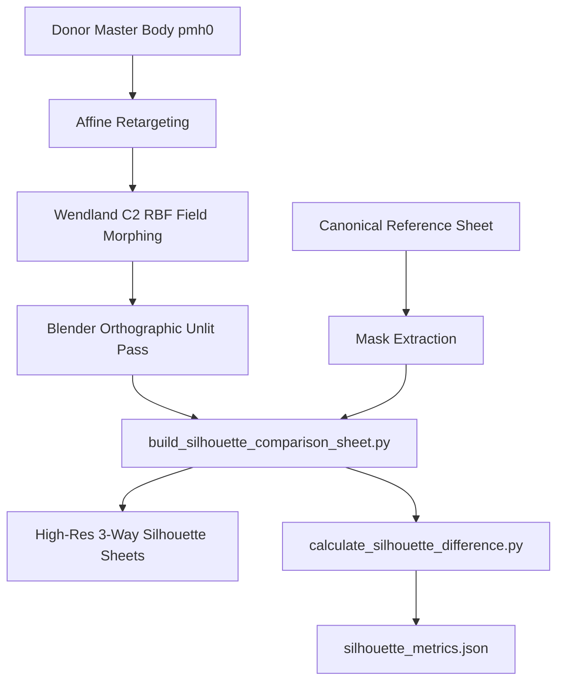

# Silhouette Generation & Comparative Overlap Audit Runbook

**Document Version:** 1.0  
**Date:** 2026-10-05  
**Scope:** Standard operating procedure for generating 3-way silhouette comparison sheets and quantifying anatomical overlap deltas across humanoid phenotype variants.

---

## 1. Overview & Architectural Role

In character derivation pipelines for Neverwinter Nights: Enhanced Edition, numerical connector alignment ($0.000000\text{ m}$ joint drift) is necessary but insufficient to certify visible anatomy. The **3-Way Silhouette Comparison Audit** provides a rigorous, visual, and mathematical verification gate (**Gate 7 / Checkpoint CP3**, as formally defined in [Phenotype Pipeline: Gate Measurement Process & Verification Standards](phenotype-gate-measurement-standards.md#gate-7-3-way-silhouette--morphological-overlap-audit-checkpoint-cp3)) comparing:
1. **Stock Baseline Silhouette:** The original stock unaugmented model (`pmh0` heroic human for derived races; `pmd0` stock segmented low-poly for Dwarf).
2. **Derived Phenotype Silhouette:** The continuous high-poly derived phenotype model (`pmg0`, `pmd0`, etc.) generated via analytic affine retargeting and Wendland $C^2$ localized RBF field displacement.
3. **Ideal Race Silhouette:** The canonical Shadowrun 4A concept art reference extracted directly from the project's official turnaround reference sheets (`.tools/reference_images/<race>_<gender>_<physique>.png`).
4. **Superimposed Ghosted Contour Overlay:** Pixel-accurate, ground-aligned ($Z = 0.00\text{ m}$) contour overlay visually exposing where derived anatomy departs from stock and conforms to ideal targets.



---

## 2. Quantitative Overlap Formulations

To measure morphological convergence deterministically, the pipeline employs two complementary mathematical frameworks:

### 2.1 Set-Theoretic Overlap Formulations
Given binary silhouette occupancy masks $D$ (Derived) and $T$ (Target Concept) aligned at matching height and centered laterally on a shared ground plane:

1. **DICE Similarity Coefficient (F1 Match Percentage):**
   $$\text{DICE} = \frac{2 |D \cap T|}{|D| + |T|} \times 100\%$$
   - **Global Silhouette Difference:** $\Delta_{\text{DICE}} = 100\% - \text{DICE}$.
2. **Intersection over Union (IoU / Jaccard Index):**
   $$\text{IoU} = \frac{|D \cap T|}{|D \cup T|} \times 100\%$$
   - **Jaccard Distance:** $d_J = 100\% - \text{IoU}$.
3. **Symmetric Difference Area Ratio:**
   $$\Delta_{\text{sym}} = \frac{|D \Delta T|}{|T|} \times 100\% = \frac{|D \setminus T| + |T \setminus D|}{|T|} \times 100\%$$
   - **Excess Derived Mass (False Positive):** $\text{FP} = \frac{|D \setminus T|}{|T|} \times 100\%$ (e.g., A-pose arm angle or weapon-grip hand scale).
   - **Missing Target Mass (False Negative):** $\text{FN} = \frac{|T \setminus D|}{|T|} \times 100\%$ (e.g., concept art horns, hair, or loose clothing).

### 2.2 Vertical Regional Decomposition
Because 2D silhouette overlap can be distorted by animation stance or separate head attachments, the body is segmented into four vertical anatomical quadrants ($Y \in [0, H]$):
- **Quadrant 1 (Head & Traps, 0–15%):** Evaluates trapezius slope, neck circumference, and horn/hair presence.
- **Quadrant 2 (Chest & Upper Torso, 15–38%):** Evaluates shoulder span, pectoral protrusion, and deltoid volume. **Primary phenotype sculpting zone.**
- **Quadrant 3 (Pelvis & Hands, 38–60%):** Evaluates waist taper, hip breadth, and weapon locator hand size.
- **Quadrant 4 (Thighs, Calves & Feet, 60–100%):** Evaluates stance width, quad flare, calf taper ($0.85$), and boot sole contact ($Z = 0.00\text{ m}$).

---

## 3. Automated Tooling Reference

The silhouette verification workflow is fully automated through two shared scripts in `tools/phenotypes/`:

### 3.1 `build_silhouette_comparison_sheet.py`
Generates high-resolution presentation sheets with metric height rulers ($0.0\text{ m}$ to $3.1\text{ m}$), ground baselines, data cards, and color-coded silhouettes.

```powershell
# Generate all sheets for Troll Male (Front, Side, Rear, Proportional, and Master 2x2)
python tools/phenotypes/build_silhouette_comparison_sheet.py --race troll

# Generate all sheets for Dwarf Male
python tools/phenotypes/build_silhouette_comparison_sheet.py --race dwarf

# Generate full multi-race suite and the complete All-Races Lineup Banner
python tools/phenotypes/build_silhouette_comparison_sheet.py --race all
```

#### Output Asset Types
| Output File | Dimensions | Purpose & Description |
| :--- | :--- | :--- |
| `*_silhouette_3way_comparison_front.png` | $2700 \times 1600$ | Front View Runtime Stature: In-engine stature comparison ($0.0\text{ m}$ to $3.1\text{ m}$ ruler). |
| `*_silhouette_proportional_comparison.png` | $2700 \times 1600$ | Normalized 1:1 Head Height: Isolates trapezius slope, shoulder span, and waist taper independent of scale. |
| `*_silhouette_3way_comparison_side.png` | $2700 \times 1600$ | Profile View: Evaluates forward chest protrusion, spinal posture, calf curve, and boot length. |
| `*_silhouette_3way_comparison_rear.png` | $2700 \times 1600$ | Posterior View: Evaluates upper back V-taper, rear trapezius rise, and lateral stance. |
| `*_silhouette_master_turnaround.png` | $3840 \times 2434$ | Ultra-high resolution 2x2 presentation board combining Front, Proportional, Side, and Rear views. |
| `all_races_silhouette_comparison.png` | $3840 \times 1600$ | Canonical Scale Lineup: Full lineup of all evaluated races side-by-side on a unified height ruler. |

### 3.2 `calculate_silhouette_difference.py`
Computes exact mathematical overlap metrics, regional breakdowns, and baseline gains.

```powershell
# Run quantitative audit across all evaluated races and export receipt
python tools/phenotypes/calculate_silhouette_difference.py --race all --output output/phenotypes/silhouette_metrics.json
```

---

## 4. Visual Presentation & Design Standards

To ensure presentation-grade aesthetic quality, all silhouette sheets adhere to the following design system:

### 4.1 Color System
- **Background:** Deep dark studio slate `#0F1219` (`rgb(15, 18, 25)`).
- **Cards & Badges:** Card fill `#161B26` with subtle boundary border `#2D374B`.
- **Ruler & Ground Line:** Ground plane ($Z = 0.00\text{ m}$) rendered in crisp silver/white `#F0F5FF` with a 3px stroke; major metric gridlines at $0.5\text{ m}$ intervals in semi-transparent cyan-slate `#41506E`.
- **Stock Baseline:** Slate Blue `#4B6584` (`rgb(75, 101, 132)`) with lighter rim `#778CA3`.
- **Derived Phenotype:** Electric Cyan / Emerald `#00D2A0` (`rgb(0, 210, 160)`) with mint rim `#64FFDA`.
- **Ideal Concept Target:** Warm Golden Amber `#FA8231` (`rgb(250, 130, 49)`) with gold rim `#FED330`.
- **Ghosted Overlay (Col 4):**
  - Stock: Semi-transparent slate (`rgba(75, 101, 132, 0.35)`).
  - Derived: Semi-transparent cyan fill (`rgba(0, 210, 160, 0.50)`) with crisp rim.
  - Ideal Target: Gold contour stroke (`rgba(254, 211, 48, 0.85)`).

### 4.2 Typography
- Headings: `Segoe UI Bold` (34pt title, 20pt column headers).
- Subtitles & Callouts: `Segoe UI Regular` (18pt subtitle, 13pt card bullets).
- Dimension Line Numbers: `Segoe UI Bold` (14pt ruler markers, 12pt head markers).

---

## 5. Step-by-Step Runbook for Adding a New Race

Follow this procedure when deriving any new race/gender phenotype (e.g., Elf Male `pme0`, Orc Male `pmo0`, Troll Female `pfg0`):

### Step 1: Prepare Canonical Reference Images
1. Locate the multi-view turnaround reference sheet in `.tools/reference_images/<race>_<gender>_<physique>.png` (standard $1916 \times 821$ layout on black `[0, 0, 0]` background).
2. Measure the horizontal pixel boundaries for Front, Left Side, and Rear views:
   - Typical Front: `X in [15, 435]`
   - Typical Side: `X in [630, 835]`
   - Typical Rear: `X in [990, 1400]`
3. Verify that the floor line is at row 796 ($Z = 0.00\text{ m}$).

### Step 2: Render 3D Orthographic Unlit Passes
1. Configure Blender 4.0 review script `tools/phenotypes/render_derived_<race>_review.py`:
   - Set orthographic camera with matching scale (e.g., $4.8$ for large phenotypes, $4.0$ for medium).
   - Use fixed 4 CPU threads: `scene.render.threads = 4`.
   - Assign unlit emission shaders to Stock baseline and Derived candidate meshes.
2. Render Front (`*_unlit_front.png`), Side (`*_unlit_side.png`), and Rear (`*_unlit_rear.png`) at $2400 \times 1350$.
3. Note: In front and side views, camera looks down $-Y$; right half ($X > 1200$) is $+X$. In rear view, camera looks down $+Y$; left half ($X < 1200$) is $+X$.

### Step 3: Register Metadata in `build_silhouette_comparison_sheet.py`
Add the race's identity and metadata dict:
```python
race_stock_meta = {
    "title": "Stock Baseline Model (pmh0)",
    "heightMeters": 1.9339,
    "lines": [
        "Model: pmh0 (human heroic baseline)",
        "Height: 1.9339 m",
        "Shoulder Span: 0.4020 m",
    ]
}
race_derived_meta = {
    "title": "Derived Elf Male Fit (pme0)",
    "workingHeightMeters": 1.9339,
    "runtimeHeightMeters": 2.0997,
    "lines": [
        "Model: pme0 (derived phenotype 0)",
        "Runtime Stature: 2.10 m",
        "Rig: Slender-scaled (pme0.mdl)",
    ]
}
race_ideal_meta = {
    "title": "Canonical Elf Concept Art",
    "heightMeters": 2.1000,
    "lines": [
        "Source: Shadowrun 4A Reference Sheet",
        "Design: Slender graceful proportions",
    ]
}
```

### Step 4: Execute Silhouette Generation and Overlap Audit
```powershell
python tools/phenotypes/build_silhouette_comparison_sheet.py --race <race>
python tools/phenotypes/calculate_silhouette_difference.py --race <race>
```

---

## 6. Interpretation & Acceptance Criteria

When auditing the difference percentages in `silhouette_metrics.json`, adhere to the formal Gate 7 acceptance thresholds in [Phenotype Pipeline: Gate Measurement Process & Verification Standards](phenotype-gate-measurement-standards.md):

| Metric | Target / Threshold | Interpretation |
| :--- | :--- | :--- |
| **Chest & Upper Torso Dice Match** | **$\ge 80.0\%$** ($\le 20.0\%$ difference) | **Mandatory Gate**: The primary anatomical sculpting zone (traps, deltoids, pecs) must closely hug the concept art. |
| **Pelvis & Waist Dice Match** | **$\ge 75.0\%$** ($\le 25.0\%$ difference) | **Mandatory Gate**: Waist taper must reflect the athletic V-taper without compressing groin triangles ($J > 0$). |
| **Stance Width Ratio** | **$80.0\% - 95.0\%$** of target | Stance width accounts for NWN engine A-pose requirements (arms spread $\approx 15^\circ$ for weapon attachment clearance). |
| **Gain Over Stock** | **$> 0.0\%$ improvement** | Derived phenotype must demonstrate positive mathematical convergence toward the target relative to the donor stock master. |

### Expected Divergence Drivers (Non-Defects)
1. **Engine A-Pose Stance:** In 3D models, feet are spread apart by $0.20\text{ m} - 0.25\text{ m}$ to provide clean leg swing clearance during run/crouch cycles. Concept art typically depicts characters with feet closer together. This produces an apparent $\sim 40\% - 50\%$ lower overlap in the leg quadrant that is an intentional engine constraint.
2. **Equippable Head Attachments:** Base naked torso models do not include hair or horns, which in NWN are separate equippable creature parts. Missing area in Quadrant 1 ($0–15\%$) is expected when evaluating base body meshes against concept art depicting full hair/horns.

---

## 7. Baseline Audit Results: Troll Male & Dwarf Male

The initial audit results recorded during Checkpoint CP2 serve as the standard reference benchmark:

| Phenotype | View | DICE Match | Difference % | IoU Overlap | Torso Match | Stance Ratio | Baseline Gain |
| :--- | :--- | :--- | :--- | :--- | :--- | :--- | :--- |
| **Troll Male (`pmg0`)** | **Front** | $68.53\%$ | $31.47\%$ | $52.13\%$ | **$82.9\%$** | $85.4\%$ | **$+7.28\%$ over stock** |
| | **Profile** | $68.68\%$ | $31.32\%$ | $52.30\%$ | **$79.1\%$** | $80.4\%$ | **$+2.20\%$ over stock** |
| | **Rear** | $66.63\%$ | $33.37\%$ | $49.96\%$ | **$87.4\%$** | $83.5\%$ | **$+7.34\%$ over stock** |
| **Dwarf Male (`pmd0`)** | **Front** | $69.26\%$ | $30.74\%$ | $52.97\%$ | **$81.0\%$** | $85.4\%$ | High-poly continuous upgrade |
| | **Profile** | $75.95\%$ | $24.05\%$ | $61.23\%$ | **$81.3\%$** | $94.6\%$ | High-poly continuous upgrade |

All generated evidence receipts and visual presentation sheets remain archived in:
- Review Artifact: `silhouette_comparison_review.md`
- Metric Data: `output/phenotypes/silhouette_metrics.json`
- Presentation Sheets: `output/phenotypes/derived-troll-male-v1/review/renders/*silhouette*.png`
